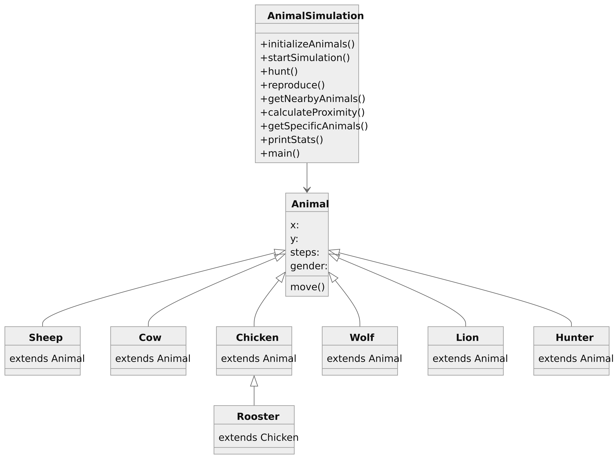

# Animal Simulation Project

## Overview
This project simulates an animal ecosystem within a 500x500 field. Various types of animals, including sheep, cows, chickens, roosters, wolves, lions, and a hunter, interact within this ecosystem. Each animal has specific behaviors such as movement, predation, and reproduction.

## Project Structure
- `AnimalSimulation.java`: Main class that orchestrates the simulation.
- `Animal.java`: Abstract class representing common properties and behaviors of animals.
- Animal subclasses (`Sheep.java`, `Cow.java`, etc.): Classes representing specific types of animals with their unique behaviors.
- `README.md`: This file providing an overview of the project and instructions for usage.

## Features
- Random movement of animals within the field.
- Predation: Predators (wolves, lions, hunter) hunt nearby prey (sheep, cows, chickens, etc.).
- Reproduction: Animals can reproduce when in close proximity, leading to the birth of new offspring.
- Simulation statistics: Tracks the population of each animal type over time.

## How to Use
1. Clone this repository to your local machine.
2. Open the project in your preferred Java IDE (e.g., IntelliJ IDEA, Eclipse).
3. Run the `AnimalSimulation.java` file to start the simulation.
4. View the console output to see the population dynamics and statistics over 1000 simulation cycles.

## Dependencies
This project does not have any external dependencies.

## Future Improvements
- Implement more realistic animal movement patterns.
- Enhance predation mechanics with success probabilities and additional predator-prey interactions.
- Visualize the simulation using graphical interfaces.
- Extend the simulation to include environmental factors such as terrain and resources.

